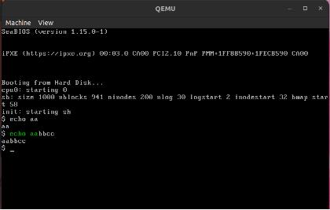

OS2024 - Domaći 1

Istorija unosa

Cilj domaćeg zadatka je izmeniti xv6 sistem tako da podržava istoriju unosa, omogućavajući korisnicima da pregledaju i ponovo koriste prethodno unete komande. Završen domaći treba da sadrži sledeće funkcionalnosti:

- Prikazivanje prethodno unetih komandi.
- Navigacija kroz istoriju unosa.
- Izbor i izvršavanje prethodno unetih komandi.

Od velike je važnosti da ova nova funkcionalnost ne naruši trenutni rad sistema. Pazite da odabir bilo koje prethodne komande, kao i njeno izvršavanje ne dovede do rušenja sistema.

Nova funkcionalnost treba da bude integrisana sa postojećim sistemom na način koji ne remeti osnovne funkcije i performanse sistema.

Na materijalima postoji snimak koji demonstrira kako izgleda rad sistema sa urađenim zadatkom.

Kod koji treba koristiti kao polaznu tačku za domaći zadatak dobija se tako što prihvatite zadatak na Github Classroom-u.

# Rad sa istorijom unosa
Istorija unosa treba da sačuva poslednje **3** **izvršene komande** (komanda se računa kao izvršena kada se pritisne **ENTER** ili kada se samo izvršila jer je bafer bio pun, čak iako je komanda imala grešku ili nije bila uspešna, i dalje se smatra izvršenom i treba je sačuvati u istoriji unosa). 

 

Kroz istoriju unosa se krećemo kombinacijom karaktera **SHIFT + ARROW\_UP** i **SHIFT + ARROW\_DOWN** (nijedna druga kombinacija sa ARROW\_UP i ARROW\_DOWN ne treba da radi prolazak kroz istoriju unosa). U istoriju unosa se ulazi kad kliknemo shift i  nagore. Ako pre ulaska u istoriju kliknemo shift i nadole, ništa se neće desiti. Kada se krećemo nagore, prikazuju se “dalje” (starije) komande, a kad se krećemo nadole prikazuju se “skorije” komande. Ako nastavimo da se krećemo nadole, izaći ćemo iz istorije unosa.

Komande iz istorije se ispisuju zelenom bojom i obratite pažnju da **prazne komande** **ne čuvamo** u istoriji. Komande koje smo sačuvali u istoriji takođe treba da mogu da se izvrše nakon što ih odaberemo iz istorije.

Na komandu iz istorije takođe možemo dodati još karaktera i oni će se ispisivati belom bojom. (slika 1)

||
| :-: |
|*Slika 1 - Na komandu iz istorije možemo dodavati još karaktera* |

Ako je korisnik kucao nešto pre ulaska u istoriju unosa, i zatim je listao kroz istoriju, kad je stigao do poslednje i komandom nadole izašao iz istorije, tekst koji je kucao pre ulaska u istoriju će biti obrisan. (ova funkcionalnost ne treba da utiče na samu istoriju unosa, već samo na tekst koji je korisnik kucao pre ulaska u istoriju - ne briše se istorija, već tekst iskucan pre ulaska u istoriju unosa, ukoliko ga je bilo) 

