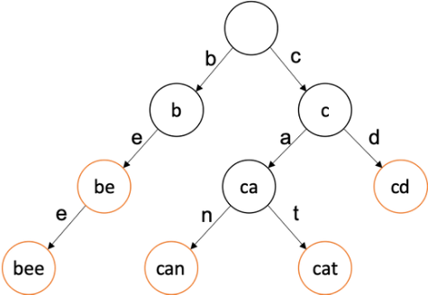

OS2024 - Domaći 4

Konkurentni autocomplete

Cilj domaćeg zadatka je napisati C program za Linux sistem koji korisniku obezbeđuje autocomplete funkcionalnost. Korisnik unosi proizvoljan prefiks, i na ekranu dobija reči koje počinju sa tim prefiksom. Potencijalne reči se čitaju iz tekstualnih datoteka. Reči u memoriji treba da se skladište u trie strukturi, koja treba da podržava konkurentno ubacivanje reči, kao i konkurentnu pretragu.

Ovaj zadatak ne zahteva rad u xv6 sistemu, niti mu je postavka grana xv6 repozitorijuma.

Uz zadatak su priloženi podaci koji mogu da se koriste za testiranje, u okviru arhive data.zip, koja se nalazi na materijalima. **Pri predaji se obavezno pobrinuti da se ovi podaci uklone iz projekta pre predaje.**

Zadatak podrazumeva samostalno čitanje man page dokumenata i drugih materijala radi pronalaženja odgovarajućih funkcija i sistemskih poziva za manipulaciju direktorijuma i vremena modifikacije.

Na materijalima postoji snimak koji demonstrira kako izgleda urađen zadatak.

**Za sve nedoumice, usvojite razumnu pretpostavku.**

# Predaja i rokovi

Ukoliko prvi put slušate predmet, zadatak se predaje putem GitHub Classroom-a. 

Rok za izradu je:

- **Utorak, 11.jun 23:59:59** 

Prijavu za odbranu četvrtog domaćeg zadatka **popuniti do 10.juna 23:59:59, naknadne prijave za odbranu se ne prihvataju**:

- **Za studente koji prvi put slušaju predmet:  <https://forms.gle/iFbVUzpfkfvte1ft8>** 
- **Za ponovce: <https://forms.gle/1GTxDtf7aU9BBnyt7>** 

Neće se pregledati zadaci (tj. biće dodeljeno 0 poena) ako se desi bilo koje od:

- Kod se ne kompajluje.
- Kod nije uredno uvučen.
- Predaja se desi nakon navedenog roka.
- Kod nije u tačnoj učionici.

Odbrana domaćih zadataka je obavezna. Odbrane će biti održane u kolokvijumskoj nedelji u četvrtak 13.juna. Odbrane će se vršiti po grupama. Grupe će biti formirane i objavljene naknadno.

Svrha odbrane je da se pokaže autentičnost zadatka. Ovo podrazumeva odgovaranje na pitanja u vezi načina izrade zadatka ili izvršavanje neke izmene nad zadatkom na licu mesta. U slučaju da odbrana nije uspešna, zadatak se boduje sa -5 bodova umesto namenjenog broja bodova.

Link za Github korisnička imena: <https://forms.gle/GrQvNZFhPrR82DxM8> 

Napomena: 

Za studente koji predmet ne slušaju prvi put, zadatak se predaje putem mejla: <estojanovic@raf.rs>, <aarsenovic@raf.rs>, <dtisma@raf.rs> ili <vkovinic@raf.rs>.

Projekat imenovati na sledeći način: 

“os\_d4\_ime\_prezime\_ind” 

primer. “os\_d4\_student\_studentic\_rn0101”

Potom arhivirati ovaj direktorijum (.zip) i arhivu poslati kao attachment uz mejl ili kao link ka drajvu na kojem se nalazi arhiva.

U tekstu mejla obavezno navesti ime, prezime i broj indeksa. 

Subject mejla mora da bude u obliku: “[OS 2024] D4 ime\_prezime\_ind”. 

primer. “[OS 2024] D4 student\_studentic\_rn0101”

Naziv arhive mora da bude u obliku: “os\_d4\_ime\_prezime\_ind.zip”

primer. “os\_d4\_student\_studentic\_rn0101.zip”

Neće se pregledati zadaci (tj. biće dodeljeno 0 poena) ako se desi bilo koje od:

- Kod se ne kompajluje.
- Kod nije uredno uvučen.
- Predaja se desi nakon navedenog roka.
- Sadržaj mejla nije po navedenom obliku.
- Subject mejla nije po navedenom obliku.
- Naziv arhive nije po navedenom obliku.

# Github Classroom
Prvo, posetite link kako biste pristupili GitHub Classroom-u za OS:

<https://classroom.github.com/a/nCgLsxAx> 

Ako nemate nalog na GitHub-u, morate ga napraviti. Ako već imate nalog, prijavite se na GitHub sa Vašim postojećim nalogom.

Nakon što prihvatite zadatak, GitHub će automatski kreirati repozitorijum za Vas sa odgovarajućim imenom. Ovaj repozitorijum možete koristiti na bilo koji način koji smatrate adekvatnim, uključujući force push i ostale konvencionalno shvaćene kao “opasne” operacije.

Da biste radili na zadatku, morate klonirati repozitorijum na svoj lokalni računar. To možete uraditi koristeći komandu git clone  u terminalu sa linkom do Vašeg repozitorijuma.

Ako dobijete grešku o autentikaciji, proverite da li ste autentikovani na GitHub za svrhe Git komandne linije. U priloženoj virtuelnoj mašini postoji uputstvo za autentikaciju u README.html fajlu.

Nakon što klonirate repozitorijum, možete početi da radite na zadatku lokalno na svom računaru.

Kada završite sa izmenama, odradite komandu  git add . da dodate sve izmene, a potom git commit -m "Opis izmena" da ih komitujete na lokalni repozitorijum.

Nakon dodavanja izmena komandom git add ., korisno je proveriti status repozitorijuma komandom git status kako biste bili sigurni da su sve izmene uspešno dodate.

Kada ste spremni da otpremite izmene na GitHub, koristite komandu git push da ih otpremite na GitHub.

**Redovno komitujte izmene kako bi asistenti imali uvid u konzistentan rad.**

Nakon što otpremite izmene, možete ih pregledati na GitHub-u da biste se uverili da su ispravne. Važno je da pratite uputstva i da se javite mejlom ako imate pitanja ili probleme, kako bismo mogli na vreme da ih uklonimo.
# Interakcija sa korisnikom
Korisnik sistemu može da zadaje komande preko komandne linije. Treba podržati sledeće komande:

1. \_add\_ <dir>
1. \_stop\_

Komanda \_add\_ dodaje novi direktorijum sa tekstualnim datotekama u sistem. Pri izvršavanju ove komande treba krairati novu scanner nit koja će da skenira taj direktorijum. Naziv direktorijuma se daje bez poslednje kose crte.

Komanda \_stop\_ gasi aplikaciju.

Ako korisnik na konzoli otkuca bilo šta drugo i pritisne enter, podrazumeva se da je poslednja reč uneta na toj liniji prefiks za koji korisnik želi da dobije autocomplete rezultate. Ukoliko korisnik unese više reči u istoj liniji, bilo koje pre poslednje se ignorišu. Na ekranu treba odmah ispisati sve reči koje su do sada pronađene koje počinju sa datim prefiksom. Ako pretraga još uvek traje, i pronađe se neka nova reč koja počinje sa tim prefiksom, treba je ispisati na ekranu. Korisnik ne može da unosi komande dok se ispisuju ove reči. Korisnik završava trenutnu pretragu kombinacijom tastera CTRL+D. Nakon unosa CTRL+D se zaustavlja ispis i korisnik može da unese novu komandu ili prefiks za pretragu.
# 
# Scanner nit
Svaka scanner nit obilazi svoj direktorijum i čita reči iz njega. Nit treba da ignoriše bilo kakve poddirektorijume i da čita sve datoteke, pretpostavljajući da one sadrže običan ASCII kodiran tekst. Ova nit treba da prati koje datoteke je već pročitala, kao i kada su te datoteke poslednji put menjane pomoću deljenog niza koji sadrži spisak svih do sada skeniranih datoteka, kao i njihovih poslednjih vremena izmena.

Kada nit naiđe na neku datoteku koju nije već pročitala, ili datoteku koja je menjana od prethodnog čitanja, ona započinje čitanje. Nit čita reč po reč iz datoteke. Reči su razdvojene znakovima SPACE (‘ ‘), TAB (‘\t’) ili ENTER (‘\n’). Ako reč sadrži bilo kakve karaktere osim malih ili velikih slova engleske abecede, treba je celu ignorisati. Reči će imati maksimalnu dužinu od 63 slova. Za reči duže od toga zadržati samo prvih 63 karaktera. Kada je reč pročitana, sva velika slova treba pretvoriti u mala. Tako obrađena reč se ubacuje u trie strukturu koja je deljena između svih scanner niti.

Kada nit obiđe svoj zadati direktorijum, ona pravi pauzu od pet sekundi, nakon čega ponovo počinje obilazak kompletnog direktorijuma. U ovom novom obilasku će se čitati samo nove i izmenjene datoteke. Nit treba da obavlja ovaj posao u beskonačnoj petlji. Ovo znači da sistem treba da detektuje i reaguje na dodavanje nove datoteke, kao i izmenu postojećih datoteka.
# 
# Trie struktura
Trie (ili prefiksno stablo) je struktura koja u svakom svom čvoru sadrži:

1. Slovo
1. Potencijalnih 26 pokazivača na decu čvorove
1. Pokazivač na roditelja
1. Flag koji naznačava kraj reči
1. Broj podreči, ne računajući samu sebe

Koren strukture je tipično prazan. Reč u trie strukturi se predstavlja kao niz čvorova od korena do lista, gde svaki naredni čvor u putanji predstavlja jedno slovo reči. Na narednoj slici je prikazan trie u koji su upisane reči: be, bee, can, cat, cd.

Narandžasti čvorovi imaju postavljen flag koji naznačava kraj reči. Primera radi, čvor **b** bi kod naše strukture imao 2 kao broj podreči, dok bi čvor **c** imao 3 kao broj podreči. Prikupljanje “autocomplete” rezultata za neki prefiks se svodi na obilazak čitavog podstabla, počevši od čvora koji predstavlja traženi prefiks. Broj podreči održavamo da bismo na početku tog obilaska mogli da inicijalizujemo strukturu koja će predstavljati rezultat pretrage. Ovaj brojač se osvežava praćenjem roditeljskih veza nakon ubacivanja nove reči kao lista u trie. Bitno je da u rezultatu bude tačno onoliko reči koliko piše u brojaču na čvoru prefiksa. Nije dozvoljeno da trie sam vrši ispis rezultata, već mora da može da ga vrati kao strukturu nekom pozivaocu. Rezultati koji su pronađeni naknadno treba da se automatski ispišu na ekranu. Kada korisnik unese CTRL+D ovaj automatski ispis treba da se zaustavi.
# Konkurentnost
U aplikaciji će postojati N + 1 nit, gde N predstavlja broj  izvršenih \_add\_ komandi, a jedna dodatna nit je main nit, iz čijeg konteksta se izvršava pretraga deljene trie strukture. Sve ove niti treba da rade sa deljenom trie strukturom uz sledeća ograničenja:

- Nikada ne smeju da se ispisuju reči koje nisu tražene nekim prefiksom.
- U nizu skeniranih datoteka treba da se nalaze sve datoteke koje su do sada skenirane, sa njihovim tačnim poslednjim vremenima modifikacije.
- Nije dozvoljeno zaključavati čitavu trie strukturu.
- Ubacivanje čvorova, kao i pretraga trie strukture treba da mogu da se obavljaju konkurentno. Pritom je dozvoljeno da operacije dodavanja ili pretrage koje se rade nad istim prefiksom bilo koje dužine to rade uz međusobno isključivanje. Npr:
  - Dodavanje “vader” i “khan” treba da se izvršava konkurentno.
  - Dodavanje “vader” i “vargoth” treba da se međusobno isključuje.
  - Pretraživanje rezultata za prefiks “luk” i dodavanje reči “jaina” treba da se izvršava konkurentno. 
  - Pretraživanje rezultata za prefiks “luk” i dodavanje reči “lucas” treba da se međusobno isključuje.

Poenta ove vrste međusobnog isključivanja je da se obezbedi što je više moguće konkurentnog rada, dok i dalje imamo garanciju da pretraga neće da bude prekinuta ubacivanjem, te da proizvede neočekivane rezultate, kao i da dva ubacivanja u istom delu stabla neće da se dešavaju istovremeno, i da se na taj način napravi loša struktura stabla.
#
#
# Funkcije i strukture
Sledi spisak predloga za strukture i funkcije unutar domaćeg zadatka. Dozvoljeno je i podstiče se izmena svega navedenog onako kako mislite da je prigodno da biste ispunili zahteve u zadatku.

#define MAX\_WORD\_LEN 64 //najveca dozvoljena duzina reci, uz \0

#define LETTERS 26 //broj slova u abecedi i broj dece u trie

extern void scanner\_init(); //poziva se jednom na pocetku rada sistema

extern void \*scanner\_work(void \*\_args); //funkcija scanner niti

extern void trie\_init(); //poziva se jednom na pocetku rada sistema

extern void trie\_add\_word(char \*word); //operacija za dodavanje reci

extern search\_result \*trie\_get\_words(char \*prefix); //operacija za pretragu

extern void trie\_free\_result(search\_result \*result); //rezultat se dinamicki alocira pri pretrazi, tako da treba da postoji funkcija za oslobadjanje tog rezultata

typedef struct trie\_node //cvor unutar trie strukture

{

`	`char c; //slovo ovog cvora

`	`int term; //flag za kraj reci

`	`int subwords; //broj reci u podstablu, ne racunajuci sebe

`	`struct trie\_node \*parent; //pokazivac ka roditelju

`	`struct trie\_node \*children[LETTERS]; //deca

} trie\_node;

typedef struct search\_result //rezultat pretrage

{

`	`int result\_count; //duzina niza

`	`char \*\*words; //niz stringova, svaki string duzine MAX\_WORD\_LEN

} search\_result;

typedef struct scanned\_file //datoteka koju je scanner vec skenirao

{

`	`char file\_name[256]; //naziv datoteke

`	`time\_t mod\_time; //vreme poslednje modifikacije datoteke

} scanned\_file;

#
# Bodovanje
Zadatak se boduje na sledeći način:

- Konkurentni skeneri			-	*3 boda*
- Trie					
  - Konkurentno dodavanje	-	*4.5 bodova*
  - Konkurentna pretraga	-	*4.5 bodova*
  - Reagovanje na dodavanje	-	*3 boda*

U slučaju da je neka od stavki implementirana parcijalno, biće dodeljeni parcijalni poeni (obavezno je demonstrirati da taj parcijalni deo zaista radi i ima efekta). 

Konačni poeni će biti objavljeni nakon svih odbrana. 

**VAŽNO:** 

Studiranje i istraživanje koda operativnog sistema kroz korišćenje koda pronađenog na internetu je dozvoljeno i može Vam pomoći u boljem razumevanju materije. Međutim potrebno je da student razume i svojim radom napiše implementaciju. 

Ukoliko više studenata koristi identičan izvorni kod pronađen na internetu, to će biti smatrano kao korišćenje istog koda i svim uključenim studentima će biti dodeljeni negativni poeni. Ista pravila važe i za korišćenje kodova generisanih veštačkom inteligencijom. 

Ukoliko studenti predaju kod sa interneta kao rešenje domaćeg zadatka biće dodeljeni negativni poeni. 

Ako asistent dođe do zaključka da zadatak nije autentičan ili da nije rađen individualno zadak će se bodovati sa -5 bodova umesto namenjenog broja bodova.

Ako se dođe do zaključka da je jedan ili više studenata kopirao zadatak od drugog studenta, svi uključeni će dobiti negativne bodove, uključujući studenta od koga je kopiran kod.

Zajedno sa negativnim poenima biće primenjena i disciplinska mera.

